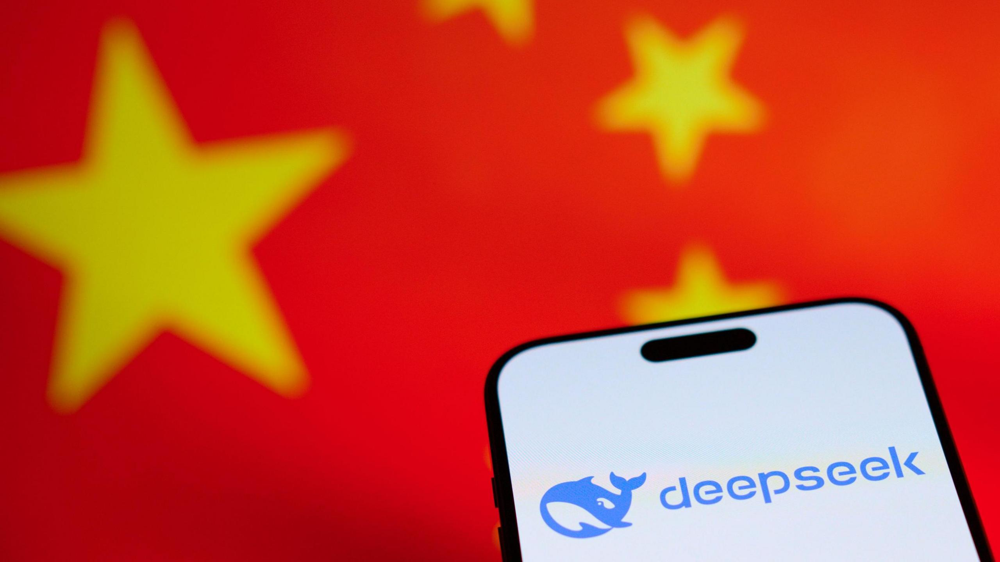

import deepseekImg from '@/images/blog/skynews-deepseek-app.jpg'

export const article = {
  date: '2025-01-29',
  title: 'DeepSeek: The Underdog Disrupting the AI Landscape',
  description:
    'DeepSeek is not just another AI model—it’s a major disruption in the industry. For years, artificial intelligence has been dominated by American companies like OpenAI, Google, and Meta. Now, a Chinese challenger has emerged, proving that Silicon Valley is no longer the only hub for cutting-edge AI.',
  img: { src: deepseekImg },
  author: {
    name: 'Benjamin Guiganton',
    role: 'FullStack Web Developer',
  },
}

export const metadata = {
  title: article.title,
  description: article.description,
}

## 1. A Market Shake-Up: An Outsider Challenges Tech Giants

DeepSeek is not just another AI model—it’s a major disruption in the industry. For years, artificial intelligence has been dominated by American companies like OpenAI, Google, and Meta. Now, a Chinese challenger has emerged, proving that Silicon Valley is no longer the only hub for cutting-edge AI.

Its rapid rise has already sent shockwaves through the financial markets. Reports that DeepSeek delivers performance comparable to OpenAI’s latest models at a fraction of the cost have rattled the industry. Nvidia, the dominant player in AI chip manufacturing, lost nearly $600 billion in market value in a single day, marking the largest one-day loss in U.S. stock market history.

## 2. DeepSeek: A "David" Against the "Goliaths" of AI

The AI race has long been driven by massive resources—billions of dollars in funding, access to state-of-the-art hardware, and exclusive partnerships with cloud providers. OpenAI, for instance, reportedly spent over $100 million to train its GPT-4 model, according to CEO Sam Altman.

DeepSeek, on the other hand, was developed with just $6 million, a staggering difference in investment. By leveraging a mix of Nvidia A100 GPUs (acquired before U.S. export bans) and cheaper, less advanced chips, the company has demonstrated that cutting-edge AI doesn’t necessarily require a multi-billion-dollar budget.

This approach is reminiscent of David versus Goliath—an agile startup challenging the tech titans by focusing on efficiency and innovation rather than brute financial force.

## 3. A Technological and Geopolitical Game-Changer

DeepSeek’s emergence also has far-reaching geopolitical implications. The U.S. has worked to restrict China’s access to advanced AI technologies, particularly by banning exports of high-end Nvidia chips like the H100. However, DeepSeek’s breakthrough suggests that these restrictions may not be enough to curb China’s rapid advancements in AI.

For the first time, an AI model developed outside the West is competing at the highest levels. This raises significant questions about the future of AI dominance and the potential end of American hegemony in the field.

Until now, OpenAI, Google, and Meta have largely dictated the pace of AI innovation. With DeepSeek proving that a low-cost, high-performance model is possible, the global AI landscape may be entering a new era of decentralized competition.

## 4. Why Competition is Good for Consumers

DeepSeek’s arrival is a win for users and businesses. The AI space has long been controlled by a handful of American firms, leading to limited choices and high subscription costs. OpenAI, for example, recently increased its pricing for enterprise users, further cementing its dominance in the premium AI market.

With DeepSeek, we now see a shift toward:

- **More affordable alternatives** – Lower computational requirements mean reduced costs for end users.
- **Diverse AI models** – DeepSeek’s open-source approach contrasts with the black-box nature of many Western models.
- **Accelerated innovation** – AI leaders will need to respond to this challenge by improving their offerings and lowering prices.

Ultimately, competition fuels better products and more accessibility for everyone. DeepSeek’s success could force major players to rethink their pricing models and technological strategies.

## 5. A More Balanced Future for AI?

DeepSeek’s rise signals a turning point: AI development is no longer exclusive to Silicon Valley. Its success demonstrates that powerful models can be built outside the traditional strongholds of tech, paving the way for a more diverse and competitive ecosystem.

While OpenAI and Google remain focused on maximizing revenue and securing enterprise clients, DeepSeek’s leaner, cost-effective approach challenges the idea that AI innovation requires massive resources.

More than just another competitor, DeepSeek represents a shift in global AI dynamics, proving that technological leadership is no longer confined to a single region. Its rapid ascent serves as a wake-up call: the AI race is now truly global, and Western dominance is no longer guaranteed.
