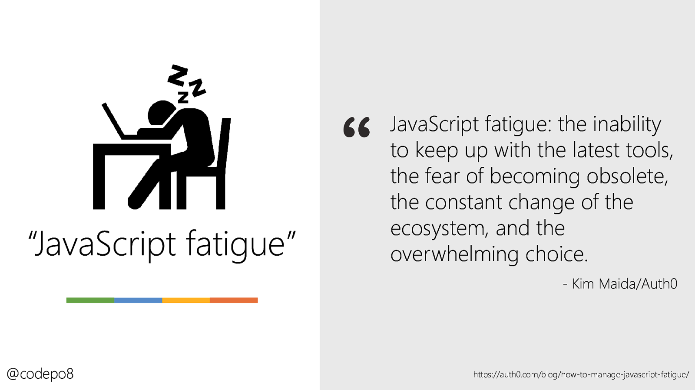
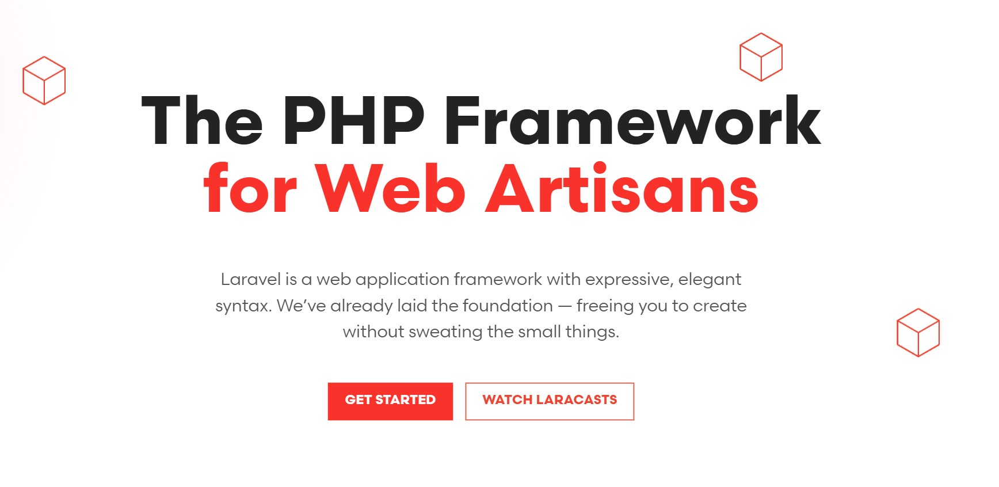
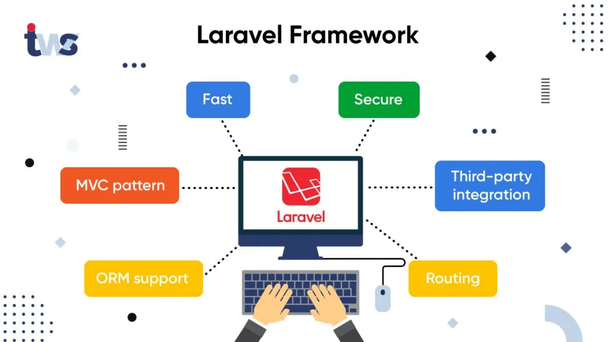
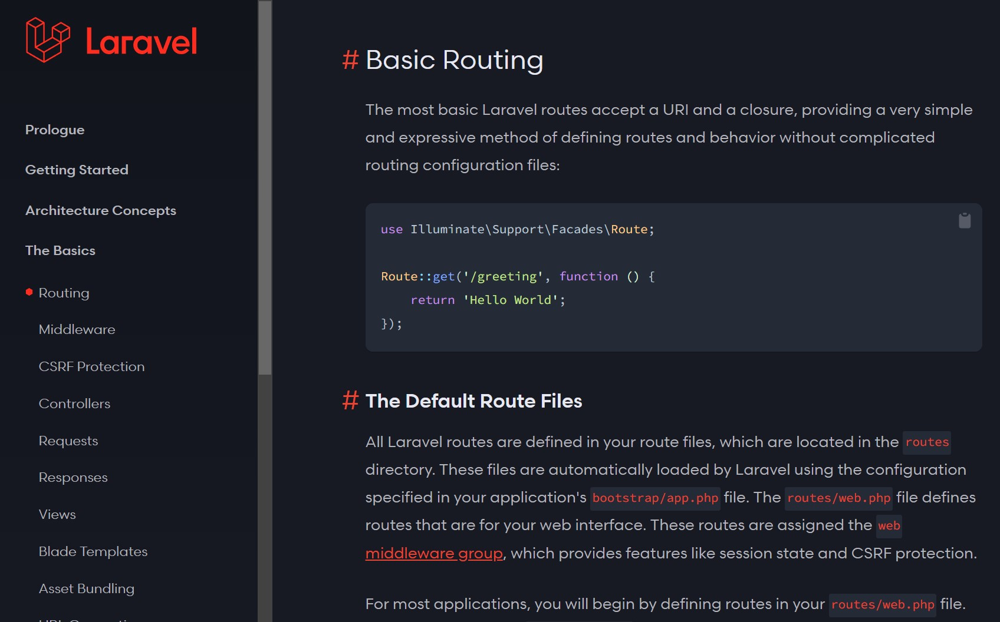
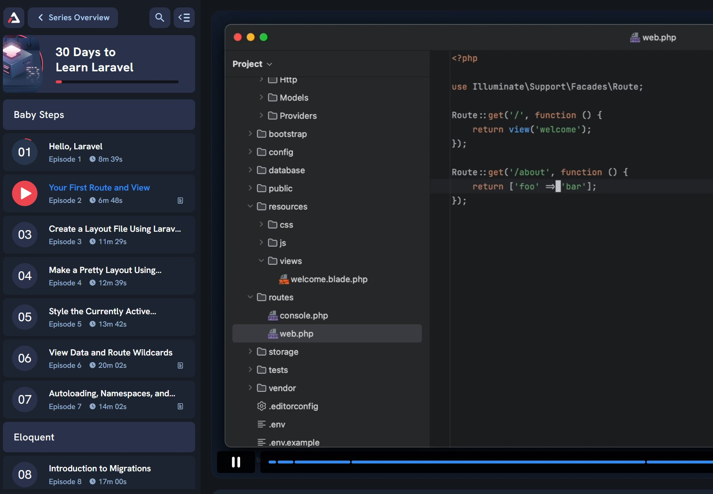

import laravelImg from '@/images/blog/laravel.png'

export const article = {
  date: '2025-01-17',
  title: 'Why I Switched to Laravel and Left Nextjs Behind',
  description:
    'As a JavaScript developer, I’ve spent years working with frameworks like React and Next.js, building everything from simple apps to complex systems. But after diving into the Laravel ecosystem, I’ve decided to leave Next.js behind.',
  img: { src: laravelImg },
  author: {
    name: 'Benjamin Guiganton',
    role: 'FullStack Web Developer',
  },
}

export const metadata = {
  title: article.title,
  description: article.description,
}

This isn’t about bashing JavaScript or its frameworks—they’ve been an essential part of my journey. Instead, it’s a reflection on why Laravel aligns better with my current needs and why I’ve grown weary of the challenges tied to modern JavaScript development.

## 1. The Burden of JavaScript Fatigue

JavaScript is dynamic, flexible, and ever-evolving. But that’s also where the problem lies. Building a project often requires stitching together countless libraries, each with its quirks, breaking changes, and updates. While this "choose your own adventure" style can be empowering, it quickly becomes overwhelming.

Next.js exemplifies this complexity. It’s marketed as a full-stack framework, blending server-side rendering, client-side interactivity, and API routes. But realistically, most projects only use a fraction of these features. The result? Developers wade through unnecessary intricacies, debugging side effects and managing dependencies, instead of focusing on their core goals.

## 2. Enter Laravel: Opinionated and Cohesive

Laravel, in contrast, offers a breath of fresh air. Its opinionated nature eliminates the guesswork of piecing together a tech stack. Need authentication? Laravel has it. Want database migrations, form validation, or email notifications? All baked in and ready to use. These tools are implemented in a way that "just works," providing a streamlined development experience.

Laravel’s simplicity feels revolutionary for developers coming from unstructured environments. After dealing with state management and rendering quirks in JavaScript, Laravel’s predictable and mature MVC (Model-View-Controller) architecture is a relief. Everything has its place, and my console is blissfully free of endless warnings or cryptic errors.

## 3. The Laravel Ecosystem: Built for Productivity

One of the standout aspects of Laravel is its ecosystem. Whether it’s Laravel Forge for deployments, Laravel Nova for admin panels, or the newly announced Laravel Cloud, the tools are designed to work together seamlessly. These integrations save hours of configuration and troubleshooting, allowing developers to focus on creating value.

For someone building SaaS products, Laravel’s ecosystem is a game-changer. It’s ridiculously easy to get a minimum viable product (MVP) up and running. Laravel empowers developers to bring their ideas to life without wrestling with fragmented tools.

## 4. Documentation and Community: The Gold Standard

Documentation often makes or breaks a developer’s experience with a framework. Laravel’s documentation is unparalleled—clear, comprehensive, and beginner-friendly. Unlike the scattered nature of Next.js resources, where you might need to scour GitHub issues or community forums, Laravel’s docs usually answer your questions upfront.

And then there’s the community. Laravel boasts a vibrant, supportive developer base that goes beyond just fanboys. Whether through Laracon, forums, or online tutorials, the sense of collaboration is palpable. It’s refreshing compared to the fragmented React ecosystem, where every developer seems to have their own "best practices."

[Learn From the Laravel Masters](https://laracasts.com/)

## 5. Why Laravel Feels Right

Switching to Laravel isn’t just about escaping JavaScript fatigue—it’s about finding a tool that aligns with how I want to work. Laravel prioritizes stability, productivity, and simplicity, making it ideal for developers who want to build robust applications without unnecessary complexity. It allows me to focus on solving problems rather than managing a labyrinth of dependencies.

## Final Thoughts

This isn’t to say that Laravel is perfect or that I’ll never use JavaScript frameworks again. React and Next.js are still incredible tools for certain use cases. But for me, Laravel’s cohesive ecosystem, developer-first design, and focus on productivity have reignited my passion for coding.

If you’re feeling overwhelmed by the ever-changing JavaScript landscape, I encourage you to give Laravel a shot. You might just find, as I did, that it’s the perfect antidote to JavaScript fatigue.
